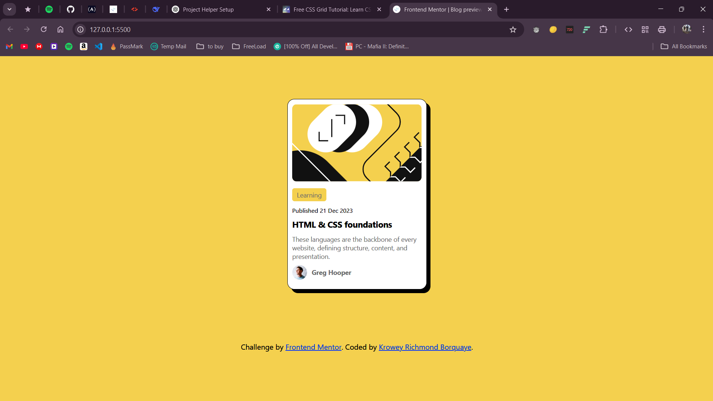

# Blog Preview Card | Frontend Mentor

<div align="center">
  <a href="https://blogcard-online.netlify.app/">Live Demo</a> | 
  <a href="https://www.frontendmentor.io/solutions/responsive-blog-card-using-flexbox-_LYawNyCTm">Solution</a> | 
  <a href="https://www.frontendmentor.io/challenges/blog-preview-card-ckPaj01IcS">Challenge</a>
</div>



A responsive blog preview card component with hover effects and semantic markup.

## Features

- Mobile-first responsive design
- Interactive hover states
- Semantic HTML5 structure
- CSS Flexbox layout
- Proper image optimization

## Built With

- HTML5
- CSS3 (Flexbox)
- Mobile-first workflow

## Key Code

```css
/* Hover effect */
.card h1:hover {
  color: hsl(47, 88%, 63%);
}

/* Centering technique */
main {
  display: flex;
  justify-content: center;
  align-items: center;
}
```

## What I Learned

- Implementing accessible hover states
- Using Flexbox for vertical centering
- Creating shadow effects with CSS
- Responsive image handling

## Author

- [Frontend Mentor](https://www.frontendmentor.io/profile/77Kromo)
- [GitHub](https://github.com/77Kromo)

<sub>Solution by Krowey Richmond Borquaye</sub>
