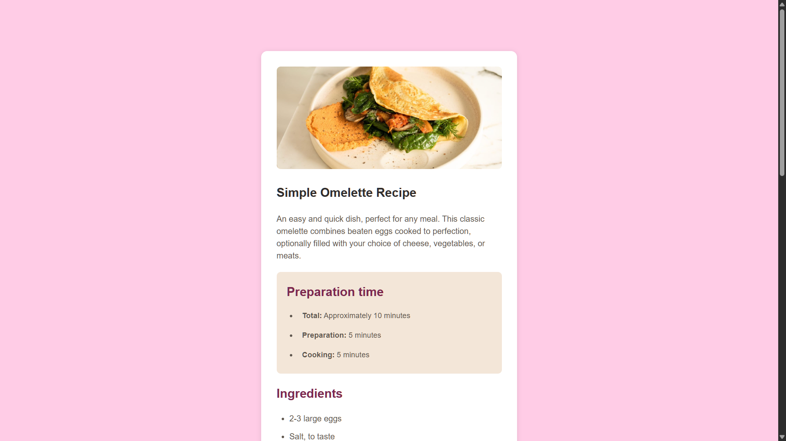

# Recipe Page | Frontend Mentor Solution

[](https://recipe-page77.netlify.app/)

A responsive recipe page for a delicious omelette, built with semantic HTML and modern CSS techniques.

## Features

- **Responsive Design**: Adapts to all screen sizes (desktop → mobile)
- **Print Optimization**: Clean layout for physical recipe cards
- **Semantic Structure**: Proper HTML5 elements for accessibility
- **Nutrition Table**: Clear nutritional information display
- **Interactive Elements**: Hover states for attribution links

## Built With

- Semantic HTML5
- CSS3 (Media Queries)
- Mobile-First Workflow
- Responsive Typography
- Print Media Queries

## Key Implementation

### HTML Structure
```html
<!-- Print-optimized content -->
<main>
  
  <h1>Simple Omelette Recipe</h1>
  
  <!-- Preparation time section -->
  <div class="prepare-time">
    <h2>Preparation time</h2>
    <ul>...</ul>
  </div>
  
  <!-- Nutrition table -->
  <table>
    <tr><td>Calories</td><td class="value">277kcal</td></tr>
  </table>
</main>
```

### CSS Highlights
```css
/* Print optimization */
@media print {
  body {
    background: white;
    color: black;
  }
  main {
    box-shadow: none;
    margin: 0;
  }
}

/* Responsive adjustments */
@media (max-width: 480px) {
  body {
    background: white;
    font-size: 14px;
  }
  .recipe-image {
    border-radius: 0;
  }
}

/* List styling */
.prepare-time ul {
  padding-left: 20px;
}
```

## What I Learned

1. **Print Media Queries**: Creating printer-friendly layouts
2. **Mobile-First Workflow**: Starting with mobile styles then adding desktop enhancements
3. **Semantic HTML**: Proper use of `<main>`, `<table>`, and heading hierarchy
4. **Responsive Images**: Ensuring images adapt to different viewports
5. **CSS Specificity**: Managing styles across multiple breakpoints

## Author

- GitHub: [77Kromo](https://github.com/77Kromo)
- Frontend Mentor: [@77Kromo](https://www.frontendmentor.io/profile/77Kromo)
- Twitter: [@kromo772004](https://x.com/kromo772004)

---

**Challenge Resources**  
[Frontend Mentor Challenge](https://www.frontendmentor.io/challenges/recipe-page-KiTsR8QQKm)  
[Solution URL](https://www.frontendmentor.io/solutions/responsive-recipe-page-tLUG4TEuQM)  
[Live Site](https://recipe-page77.netlify.app/)
